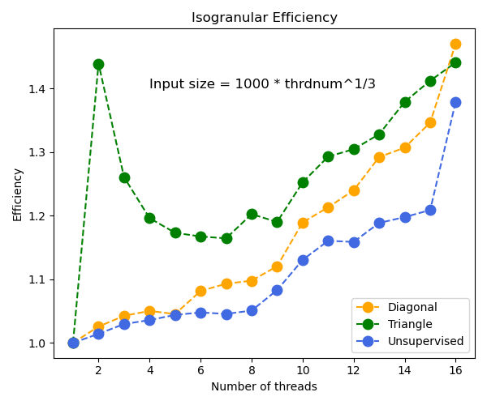

# :dna:ParallelRNA:dna:: Parallel RNA structure counting algorithm 
Secondary structures for nucleic acid sequences, DNA and RNA, are useful abstractions when examining certain behaviors of those molecules. We examine the problem of finding a secondary structure with maximum number of base pairs. The Nussinov algorthm solves this problem in cubic time. 
Our aim is to come up with parallelization of Nussoniv algorithm. 

## 0. Prerequisites
g++ <br />
openmp <br />

### How to compile and run
```
g++ -o max_pair_omp src/max_pair_omp.cpp -fopenmp 

./max_pair_omp input.txt num_threads
```
## 1. Algorithms

### 1.1. Diagonal Algorithm
The first type of parallel algorithm breaks up each diagonal into chunks that each OMP thread solves individually. Once a chunk is done, it waits for the remaining threads to finish to move on to the next diagonal section.
<br>
 <br>


### 1.2. Triangle Algorithm
The second type of parallel algorithm breaks up each diagonal into chunks and computes a full triangle of the matrix. After it fills this triangle and all threads finish, it computes the inverted triangle such that after a triangle and inverted triangle are complete, the matrix has a perfect diagonal on which it can run the algorithm again.
<br>


### 1.3. Unsupervised Algorithm
Finally, we include an unsupervised algorithm. The two previous algorithms tell OMP the size of chunk each thread should work on. However, sometimes it is faster to let OMP assign threads tasks on its own. This algorithm is functionally similar to the Diagonal Algorithm, except it does not define a specific chucnk length or starting and ending position, it simply fills in the diagonals in whichever order OMP sees fit.

## 2. Scalability
### 2.1 Fixed Problem-Size Parallel Efficiency
To compute fixed problem-size parallel efficiency, we must first compute speed-up. This is defined as the time it takes to run on one node divided by the time it takes to run on <i>P</i> nodes. From this value, we can compute efficiency as <i>Speed-up/P</i>. The following plots define the fixed problem size efficiency for the different algorithms using an input RNA of 5000 bases.
<br>
<br>
<p align='center'></p>
<p align='center'></p>
<p align='center'></p>
<br><br>

Here, we demonstrate that all of the parallel algorithms out perform the original algorithm. Further, the Triangle Algorithm and Unsupervised Algorithm outperform the naive OMP implementation. At low thread counts, the Triangle Algorithm has better speed-up and efficiency than the Unsupervised Algorithm. However, at higher thread counts, the Unsupervised Algorithm has better speed-up and efficiency than the Triangle Algorithm.

### 2.2 Isogranular Scaling


Here we analyze the isogranular scaling of the three parallel algorithms. Since
the max pair algorithm is cubic and we parallelize one loop, an ideal parallel
algorithm would take same amount of time as the input size is increased by 
, 
where  is the number of threads.
We there ran each program with input size increasing with 
 and
analyzed the efficiency. As a result, for all three programs the efficiency was
about 1.4 with the number of threads being 16. The unsupervised algorithm
tended to be closer to the ideal behavior. 

## Author Contributions
<!--## 2. Files-->
<!--The following files are included in this folder, in addition to this readme-->
<!--file, readme.md.-->
<!--<ul>-->
<!--<li>md.c: Main C program</li>-->
<!--<li>md.h: Header file for md.c</li>-->
<!--<li>md.in: Input parameter file (to be redirected to the standard input)</li>-->
<!--</ul>-->
<!---->
